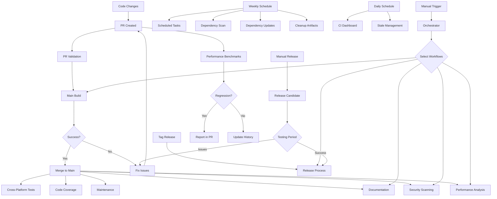

# HDR+ Swift CI/CD Workflows

This directory contains GitHub Actions workflows for the HDR+ Swift project.

## Workflow Structure

The CI/CD system is organized into multiple specialized workflows:

| Workflow | Description | Triggers |
|----------|-------------|----------|
| [main.yml](main.yml) | Primary build and test pipeline | Push to main, PRs, manual |
| [pr-validation.yml](pr-validation.yml) | PR quality checks and validation | PRs only |
| [release.yml](release.yml) | Release automation | Tags starting with 'v' |
| [security.yml](security.yml) | Security scanning | Push to main, PRs, weekly schedule, manual |
| [performance.yml](performance.yml) | Performance tracking | Push to main, weekly schedule, manual |
| [documentation.yml](documentation.yml) | API documentation generation | Push to main, manual |
| [maintenance.yml](maintenance.yml) | Repository maintenance | Push to main, manual |
| [scheduled.yml](scheduled.yml) | Scheduled cleanup tasks | Weekly schedule, manual |
| [code-coverage.yml](code-coverage.yml) | Code coverage reporting | Push to main, PRs, weekly schedule, manual |
| [cross-platform.yml](cross-platform.yml) | Cross-platform compatibility testing | Push to main, PRs, weekly schedule, manual |
| [dependency-scan.yml](dependency-scan.yml) | Dependency vulnerability scanning | Push to main, weekly schedule, manual |
| [dashboard.yml](dashboard.yml) | CI/CD dashboard generation | Daily schedule, manual |
| [orchestrator.yml](orchestrator.yml) | Centralized workflow orchestrator | Manual only |
| [dependency-updates.yml](dependency-updates.yml) | Automated dependency updates | Weekly schedule, manual |
| [stale-management.yml](stale-management.yml) | Manage stale issues and PRs | Daily schedule, manual |
| [release-candidate.yml](release-candidate.yml) | Release candidate testing | Manual only |
| [performance-benchmarks.yml](performance-benchmarks.yml) | Performance regression detection | Push to main, PRs, weekly schedule, manual |
| [cleanup-artifacts.yml](cleanup-artifacts.yml) | Clean up old workflow artifacts | Weekly schedule, manual |
| [binary-size.yml](binary-size.yml) | Binary size analysis and tracking | Push to main, PRs, manual |

## Reusable Components

The CI system uses several reusable components:

### Configuration Files
- [versions.env](../.github/versions.env) - Shared environment variables for version info and configuration
- [workflow-config.yml](../.github/workflow-config.yml) - Shared YAML configuration for workflows

### Composite Actions
- [setup-swift](../.github/actions/setup-swift) - Sets up Swift environment with caching
- [extract-version](../.github/actions/extract-version) - Extracts version information from git tags
- [notify-slack](../.github/actions/notify-slack) - Sends notifications to Slack
- [generate-changelog](../.github/actions/generate-changelog) - Generates formatted changelog from commits
- [load-config](../.github/actions/load-config) - Loads shared configuration values from YAML
- [build-cache](../.github/actions/build-cache) - Advanced caching strategy for Swift/Xcode builds
- [run-benchmarks](../.github/actions/run-benchmarks) - Runs and analyzes performance benchmarks
- [setup-macos-build](../.github/actions/setup-macos-build) - Configures macOS build environment with code signing settings
- [security-scan-macos](../.github/actions/security-scan-macos) - Runs security checks specifically for macOS Swift code

### Local Development Tools
- [local-validate.sh](../.github/scripts/local-validate.sh) - Script for validating changes locally
- [setup-hooks.sh](../.github/scripts/setup-hooks.sh) - Script for setting up git hooks
- [branch-protection.sh](../.github/branch-protection.sh) - Script for configuring branch protection rules

### Project Templates
- [PULL_REQUEST_TEMPLATE.md](../.github/PULL_REQUEST_TEMPLATE.md) - Template for pull requests
- [ISSUE_TEMPLATE](../.github/ISSUE_TEMPLATE) - Templates for bug reports, feature requests, and documentation updates

## Advanced Features

### Workflow Orchestration
Use the orchestrator workflow to trigger multiple workflows in sequence with consistent parameters:
```
gh workflow run orchestrator.yml -f workflows=main,security,performance,code-coverage
```

### Code Coverage Reporting
Tracks code coverage metrics over time and compares coverage changes in PRs:
```
gh workflow run code-coverage.yml
```

### Cross-Platform Testing
Tests the codebase on multiple platforms and Swift/Xcode versions:
```
gh workflow run cross-platform.yml -f platform_filter=macos-14,ubuntu-latest
```

### CI/CD Dashboard
Generates a visual dashboard of all CI/CD activity, deployed to GitHub Pages:
```
gh workflow run dashboard.yml
```

### Automated Dependency Updates
Checks for dependency updates and creates PRs for Swift packages and CocoaPods:
```
gh workflow run dependency-updates.yml -f create_pull_request=true
```

### Release Candidate Testing
Creates and tests a release candidate with expiration date:
```
gh workflow run release-candidate.yml -f version=1.2.0-rc.1 -f expire_days=7
```

### Repository Management
Manages stale issues and PRs, automatically closing inactive ones:
```
gh workflow run stale-management.yml
```

### Branch Protection
Set up comprehensive branch protection rules:
```
.github/branch-protection.sh YOUR_GITHUB_TOKEN owner repo
```

### Performance Benchmarking
Track and analyze performance metrics, detecting regressions automatically:
```
gh workflow run performance-benchmarks.yml
```

### Artifact Cleanup
Clean up old workflow artifacts to save storage space:
```
gh workflow run cleanup-artifacts.yml -f days_old=30 -f dry_run=true
```

### Binary Size Analysis

Track and analyze binary size of your app builds:

```
gh workflow run binary-size.yml
```

This will:
- Build your app in Release configuration
- Calculate app bundle and executable sizes
- Check against defined thresholds
- Report detailed size information

### Enhanced Security Scanning

The security workflow now includes:
- CodeQL analysis with Swift support
- macOS-specific security checks using SwiftLint
- Detection of insecure API usage
- Scanning for hardcoded credentials

```
gh workflow run security.yml
```

## Build Optimization

The CI system includes several optimizations to improve build performance:

### Advanced Caching
The `build-cache` action provides smart caching for:
- Swift Package Manager dependencies
- Xcode derived data
- CocoaPods dependencies

### Parallel Execution
Jobs run in parallel where possible, with dependencies declared where needed.

### Conditional Execution
Many jobs only run when certain conditions are met, avoiding unnecessary work.

### Code Signing in CI
The `setup-macos-build` action handles code signing configuration:
- Disables code signing for CI builds by default
- Supports actual code signing with team ID when needed
- Creates custom xcconfig settings for disabling code signing

## How to Use

### Running Workflows Manually

Most workflows can be triggered manually from the GitHub Actions tab. Look for the "workflow_dispatch" trigger.

### Adding a New Workflow

1. Create a new YAML file in the `.github/workflows` directory
2. Use existing workflows as templates
3. Reuse shared components for consistency
4. Update this README to document the new workflow

### Debugging Workflow Issues

If a workflow is failing:

1. Check the workflow run logs for detailed error messages
2. Verify that environment variables and secrets are properly configured
3. Try running the workflow manually to isolate issues
4. For PR validation issues, make sure your PR follows the required conventions

### Performance Testing

When running performance tests:

1. Use the `run-benchmarks` action in your workflow
2. Create baselines from stable releases
3. Check for regressions in PRs automatically
4. View historical benchmark data to identify long-term trends

## Continuous Improvement

We welcome suggestions for improving these workflows. If you have ideas:

1. Open an issue to discuss the proposed changes
2. Submit a PR with your improvements
3. Update documentation to reflect your changes

## Workflow Visualization

