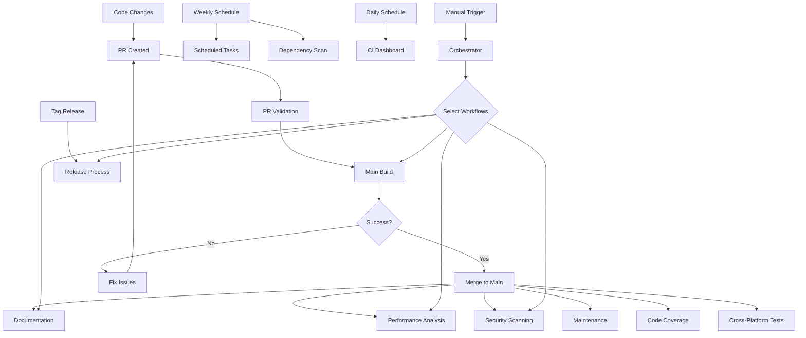

# HDR+ Swift CI/CD Workflows

This directory contains GitHub Actions workflows for the HDR+ Swift project.

## Workflow Structure

The CI/CD system is organized into multiple specialized workflows:

| Workflow | Description | Triggers |
|----------|-------------|----------|
| [main.yml](main.yml) | Primary build and test pipeline | Push to main, PRs, manual |
| [pr-validation.yml](pr-validation.yml) | PR quality checks and validation | PRs only |
| [release.yml](release.yml) | Release automation | Tags starting with 'v' |
| [security.yml](security.yml) | Security scanning | Push to main, PRs, weekly schedule, manual |
| [performance.yml](performance.yml) | Performance tracking | Push to main, weekly schedule, manual |
| [documentation.yml](documentation.yml) | API documentation generation | Push to main, manual |
| [maintenance.yml](maintenance.yml) | Repository maintenance | Push to main, manual |
| [scheduled.yml](scheduled.yml) | Scheduled cleanup tasks | Weekly schedule, manual |
| [code-coverage.yml](code-coverage.yml) | Code coverage reporting | Push to main, PRs, weekly schedule, manual |
| [cross-platform.yml](cross-platform.yml) | Cross-platform compatibility testing | Push to main, PRs, weekly schedule, manual |
| [dependency-scan.yml](dependency-scan.yml) | Dependency vulnerability scanning | Push to main, weekly schedule, manual |
| [dashboard.yml](dashboard.yml) | CI/CD dashboard generation | Daily schedule, manual |
| [orchestrator.yml](orchestrator.yml) | Centralized workflow orchestrator | Manual only |

## Reusable Components

The CI system uses several reusable components:

### Configuration Files
- [versions.env](../.github/versions.env) - Shared environment variables for version info and configuration
- [workflow-config.yml](../.github/workflow-config.yml) - Shared YAML configuration for workflows

### Composite Actions
- [setup-swift](../.github/actions/setup-swift) - Sets up Swift environment with caching
- [extract-version](../.github/actions/extract-version) - Extracts version information from git tags
- [notify-slack](../.github/actions/notify-slack) - Sends notifications to Slack
- [generate-changelog](../.github/actions/generate-changelog) - Generates formatted changelog from commits
- [load-config](../.github/actions/load-config) - Loads shared configuration values from YAML

### Local Development Tools
- [local-validate.sh](../.github/scripts/local-validate.sh) - Script for validating changes locally
- [setup-hooks.sh](../.github/scripts/setup-hooks.sh) - Script for setting up git hooks

## Advanced Features

### Workflow Orchestration
Use the orchestrator workflow to trigger multiple workflows in sequence with consistent parameters:
```
gh workflow run orchestrator.yml -f workflows=main,security,performance,code-coverage
```

### Code Coverage Reporting
Tracks code coverage metrics over time and compares coverage changes in PRs:
```
gh workflow run code-coverage.yml
```

### Cross-Platform Testing
Tests the codebase on multiple platforms and Swift/Xcode versions:
```
gh workflow run cross-platform.yml -f platform_filter=macos-14,ubuntu-latest
```

### CI/CD Dashboard
Generates a visual dashboard of all CI/CD activity, deployed to GitHub Pages:
```
gh workflow run dashboard.yml
```

## How to Use

### Running Workflows Manually

Most workflows can be triggered manually from the GitHub Actions tab. Look for the "workflow_dispatch" trigger.

### Adding a New Workflow

1. Create a new YAML file in the `.github/workflows` directory
2. Use existing workflows as templates
3. Reuse shared components for consistency
4. Update this README to document the new workflow

### Debugging Workflow Issues

If a workflow is failing:

1. Check the workflow run logs for detailed error messages
2. Verify that environment variables and secrets are properly configured
3. Try running the workflow manually to isolate issues
4. For PR validation issues, make sure your PR follows the required conventions

## Continuous Improvement

We welcome suggestions for improving these workflows. If you have ideas:

1. Open an issue to discuss the proposed changes
2. Submit a PR with your improvements
3. Update documentation to reflect your changes

## Workflow Visualization

