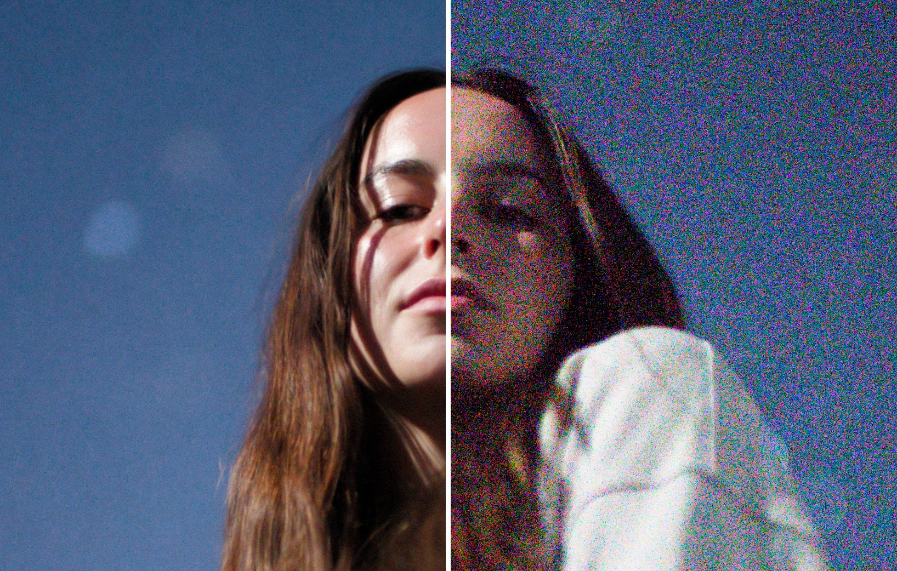

# HDR+ Swift


[](https://github.com/SZim92/hdr-plus-swift/actions/workflows/cross-platform.yml)

## About
HDR+ Swift is a Swift implementation of Google's HDR+ burst photography algorithm, designed for computational photography on macOS. This project aims to bring powerful HDR image processing to Swift developers and photography enthusiasts.

## Features
- Multi-frame burst photography processing
- Automatic alignment of burst frames
- Temporal merging for noise reduction
- HDR tone mapping
- Local and global contrast enhancement

## Installation
Clone this repository and open the Xcode project:

```bash
git clone https://github.com/SZim92/hdr-plus-swift.git
cd hdr-plus-swift
open burstphoto.xcodeproj
```

## Requirements
- macOS 13.0+ (Ventura)
- Xcode 15.0+
- Swift 5.9+

## Development

### CI System

This project uses GitHub Actions for continuous integration. For details on the CI system, see [CI_DOCS.md](CI_DOCS.md).

#### CI Platform Support

- **macOS-only Testing**: Due to Metal API requirements, automated testing is only performed on macOS platforms (currently Sonoma and Ventura).
- **Build Verification**: CI primarily verifies that the code builds successfully and collects Metal environment diagnostics.
- **Local Testing**: For full testing including Metal shaders, use physical devices with proper GPU support.

### Documentation Standards

This project follows consistent markdown formatting standards to ensure documentation readability and accessibility. For details on the standards and how to check your files, see [MARKDOWN_STANDARDS.md](MARKDOWN_STANDARDS.md).

Burst Photo is a macOS app written in Swift / SwiftUI / Metal that implements a simplified version of HDR+, the computational photography pipeline in Google Pixel phones. With Burst Photo, this processing can be applied to a burst of images from any camera, increasing dynamic range and reducing noise of the resulting image. You can read more about HDR+ in Google's paper [Burst photography for high dynamic range and low-light imaging on mobile cameras](http://static.googleusercontent.com/media/www.hdrplusdata.org/en//hdrplus.pdf).

If you are a researcher or you prefer Python/PyTorch, you can check out [hdr-plus-pytorch](https://github.com/martin-marek/hdr-plus-pytorch).

In the example, a burst of 51 images was taken at ISO 51,200 on a Sony A7S III camera. Exposure was adjusted to taste with equal settings for both images. Here is a [comparison](docs/assets/images/gallery/monika_stars.jpg) of a single image from the burst versus a merge of all the images.



To test motion-robustness, a burst with strong scene motion is evaluated. Here is a [full comparison](docs/assets/images/gallery/robustness_comparison.jpg) of results. The figure is similar to Figure 6 in Google's original [publication](http://static.googleusercontent.com/media/www.hdrplusdata.org/en//hdrplus.pdf). The input image was taken from Google's [HDR+ dataset](https://hdrplusdata.org/dataset.html) licensed under [CC BY-SA](https://creativecommons.org/licenses/by-sa/4.0/).


For more examples, please visit [burst.photo/gallery/](https://burst.photo/gallery/).

To process a burst of RAW images, simply drag-and-drop them into the app. Only DNG files are supported by default - but if you download and install [Adobe DNG Converter](https://helpx.adobe.com/camera-raw/using/adobe-dng-converter.html), Burst Photo will be able to convert most RAW formats in the background. The resulting image will be in the RAW-DNG format and can be further processed with the RAW converter of choice. You can read more at [burst.photo/help/](https://burst.photo/help/).


You can download the app from the [Mac App Store](https://burst.photo/download/) or as a [GitHub release](https://github.com/martin-marek/hdr-plus-swift/releases).

- [x] DNG support
- [x] RAW support (requires Adobe DNG Converter to be installed)
- [x] simple temporal averaging
- [x] motion-robust merge in spatial domain (simplified)
- [x] motion-robust merge in frequency domain (similar to original publication)
- [x] Bayer sensor support
- [x] non-Bayer sensor support (beta)
- [x] support for bursts with bracketed exposure
- [x] optional exposure correction to improve tonality in the shadows
- [x] optional output with full 16 bit precision
- [x] preserves lens profiles
- [x] hot pixel suppression
- [x] multi-threaded RAW conversion and image loading
- [x] caching of converted DNGs both on disk and in-memory
- [x] align+merge running in pure Metal
- [x] native Intel, Apple Silicon support

- [ ] add super-resolution algorithm
- [ ] add support for demosaic images (or foveon cameras)
- [ ] fix progressbar getting stuck loading the first image

Please feel free to contribute to any of these features or suggest other features.

This product includes DNG technology under license by Adobe.
